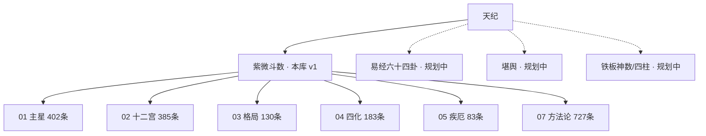
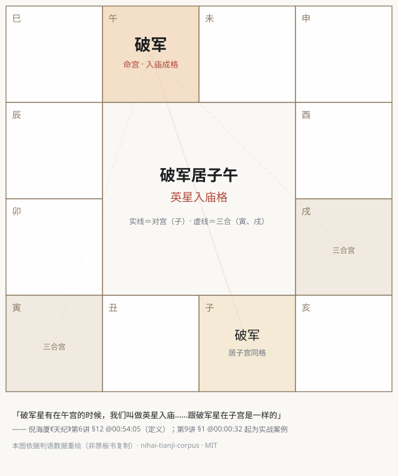

# 倪海厦《天纪》结构化语料库 · nihai-tianji-corpus

     

> 把倪海厦先生《天纪》课程做成**每一句都可回放验证**的结构化知识库。
> 每条判语 = 倪师原话短引文 + 六册体系归属 + 精确到秒的视频出处。
> 点任何一条的出处，直达 B 站原视频的那一秒，听倪师亲口讲这句话。

## 数字总览

| 指标 | 数值 |
|---|---|
| 判语条目 | **1910 条**（引文净字数 149,315 字） |
| 覆盖课程 | 天纪 · 紫微斗数全部 **14 讲**（约 12.4 小时） |
| 知识体系 | **六册**（主星 / 十二宫 / 格局 / 四化 / 疾厄 / 方法论），倪师授课原生分类 |
| 课程索引 | 14 讲 × **约 180 个语义段**，段级 B 站回放直链 |
| 溯源精度 | 每条带 `[讲 §段 @时:分:秒]`，可拼接 B 站 `?p=N&t=秒` 一键回放 |
| 质检 | 双源交叉验证 + 七道自动门禁 + 121 条归类抽查（放错 0 条） |
| 人工勘误 | 133 对字幕错字逐条人工裁决，账本全量公开 |

## 一条判语长什么样

**人读**（`docs/` 六册内的形态）：

> - 「比如说，你是一子送终，你是半空折翅，通通从福德宫里面批出来的。」 [p03 §10 @00:40:09]

**机读**（`data/entries.jsonl` 内的形态）：

```json
{"book": "03-patterns", "h2": "…", "h3": "…",
 "quote": "比如说，你是一子送终，你是半空折翅，通通从福德宫里面批出来的。",
 "part": 3, "section": 10, "t_hms": "00:40:09", "cue_from": 913, "cue_to": 915, "note": ""}
```

**回放**：`https://www.bilibili.com/video/BV1KJsLekEfA?p=3&t=2409` ← 打开就是倪师讲这句话的瞬间。

## 知识体系（倪师授课原生分类，非自创）



| 册 | 条数 | 内容 | 代表判语（真实条目） |
|---|---|---|---|
| [01 主星](docs/01-主星.md) | 402 | 十四主星与辅煞星的定性、性情、格局 | 「我们分南斗还有北斗。北斗星系第一颗星我们叫做紫微星。」 [p05 §4 @00:26:02] |
| [02 十二宫](docs/02-十二宫.md) | 385 | 命宫至父母宫、三方四正、借星 | 「一个人除了本身把自己加进去以外，会受到周围环境有另外11个层面的影响。」 [p03 §4 @00:11:54] |
| [03 格局](docs/03-格局.md) | 130 | 吉格 / 凶格 / 结构性警示 | 「你是一子送终，你是半空折翅，通通从福德宫里面批出来的。」 [p03 §10 @00:40:09] |
| [04 四化](docs/04-四化.md) | 183 | 化科 / 化权 / 化禄 / 化忌 | 「这个四化星是我们的主力星，所以要从四化星开始介绍。」 [p05 §1 @00:00:48] |
| [05 疾厄](docs/05-疾厄.md) | 83 | 十二地支宫配脏腑、病灾判断 | 「诸位看斗数上面的疾厄宫，参考可以。但是你真的批的时候他就没有用。」 [p03 §11 @00:44:35] |
| [07 方法论](docs/07-方法论.md) | 727 | 天纪总纲、批命顺序、学习法 | 「现在世界上十之八九的人上了船以后，就以为拿到真理。」 [p03 §1 @00:01:07] |

（07 为沿用历史编号，无 06 册。）

另一条浏览轴是**课程轴**：[docs/课程索引.md](docs/课程索引.md) —— 14 讲逐讲的语义段大纲，
每段带主题和回放直链，等于给 12.4 小时的课配了一份可点击的目录。

## 格局重绘图（第三层，试点中）

倪师板书上的盘面，依判语数据用 SVG **重新绘制**（不复制视频任何像素），首张试点：



图注锚定真实出处：定义见第 6 讲 §12 @00:54:05，实战案例见第 9 讲 §1。
重绘图为本仓库原创，MIT 许可，后续按格局逐张补充。见 [docs/charts/](docs/charts/)。

## 这 1.9 MB 从哪来（蒸馏链）

```
约 20 GB   1620×1080 视频（B 站公开，不收录）
   ↓ 字幕带逐帧 OCR（上传者人工校正的字幕为真值）
约 25 万字  14 讲全量转写 · 2.1 万条毫秒级时间码 cue（涉全文复制，永不发布）
   ↓ whisper large-v3-turbo 探针逐条交叉验证 · 语义分段 · 判语提炼（提炼比约 60%）
14.9 万字  1910 条判语（本库）
```

体积小是蒸馏的结果，不是工作量的度量——《红楼梦》全本 73 万字也才约 2.2 MB。
纯文本知识库的正常密度就是如此。

## 数据是怎么保真的

| 机制 | 说明 |
|---|---|
| 双源交叉 | OCR 主源 × whisper 探针独立转写，逐讲一致率 60.3%–80.6%，脚本自算不采信自报 |
| 七道门禁 | 去重 / 探针覆盖≥95% / 一致率≥60% / 术语白名单 / 出处可回溯≥95% / 逐字命中≥90% / 空批次防线 |
| 原话不改字 | 仅删口语赘词、补标点；字幕错字须人工逐条裁决，改动留痕 `〔已按裁决改正：X→Y〕` |
| 勘误账本 | 133 对全量公开于 [data/corrections-ledger.jsonl](data/corrections-ledger.jsonl)，幂等可重放 |
| 归类抽查 | 121 条分层抽样独立复核，确认放错 0 条 |

完整数据见 **[docs/质量验收档案.md](docs/质量验收档案.md)**（逐讲一致率表、门禁定义、返工记录）。

## 快速开始

**人**：直接读 [docs/](docs/) 六册，GitHub 原地渲染；想跟课就从 [课程索引](docs/课程索引.md) 进。

**AI / RAG**（详见 [AI 使用手册](docs/AI使用手册.md)）：

```python
import json

entries = [json.loads(l) for l in open("data/entries.jsonl", encoding="utf-8")]

# 一条判语 = 一个 chunk，不需要再切；book/h2/h3/part 都是现成的检索过滤器
broken = [e for e in entries if e["book"] == "01-stars" and "破军" in e["quote"]]

# 给用户带上可验证出处
def url(e):
    h, m, s = map(int, e["t_hms"].split(":"))
    return f"https://www.bilibili.com/video/BV1KJsLekEfA?p={e['part']}&t={h*3600+m*60+s}"
```

**整包投喂**：[data/corpus-rag.md](data/corpus-rag.md) 单文件约 20 万字（30 万+ token），
直接放进长上下文或做系统级知识注入。

## 想要中间层（帧 / 音频 / 转写）？

本库不分发它们——那属于对原视频的再分发（见下方版权说明）。但**管线全部开源**：
照 [tools/REPRODUCE.md](tools/REPRODUCE.md)，从 B 站公开视频出发，
在自己机器上完整复现每一个中间层，文内已写清全部踩坑点（音轨选择、whisper 参数陷阱、水印过滤等）。

## Roadmap

- [x] 天纪 · 紫微斗数 14 讲（1910 条）——**v1.0，已发布**
- [x] 质检档案 / AI 手册 / 复现指南
- [x] 格局重绘图试点
- [ ] 格局重绘图批量化（03 册主要格局逐张）
- [ ] 天纪 · 易经六十四卦（30 讲，约 19.7 小时）
- [ ] 天纪 · 堪舆（4 讲）与铁板神数 / 四柱（8 讲）
- [ ] 网站呈现层（双轴导航 + 判语卡 + 一键回放，开发中）

## 关联项目

- [ziwei-doushu](https://github.com/Renhuai123/ziwei-doushu) —— 紫微斗数开源排盘引擎（算法 + 51.8 万命盘样本）。
  本库是它的知识层：排盘引擎算出盘，本库回答「倪师怎么论这个盘」。

## FAQ

**Q：为什么整个仓库才 1.9 MB？**
文本知识库的正常密度。12.4 小时讲课的全部话语约 25 万字（约 1 MB），本库是其中六成的判语精华加结构。大文件是视频和音频——那是载体，不是知识。

**Q：怎么验证这些判语不是编的？**
任何一条：按出处拼 URL 回放原视频听原话。全库 1910 条，条条如此。质检全程数据公开在[质量验收档案](docs/质量验收档案.md)。

**Q：能商用吗？**
语料部分是 CC BY-NC-SA（非商业）。原课程著作权归倪海厦先生权利方，商用请先取得其授权。`tools/` 代码 MIT，随意。

## 版权与致谢

- 《天纪》课程内容著作权归**倪海厦先生及其权利继承人**所有。
- 感谢 B 站 UP 主**程心学**对字幕的逐字校正整理，本库转写以其校正字幕为真值源。
- 本库仅收录短引文 + 出处的结构化条目，用于学习研究；**不含**可还原完整课程的逐字稿；
  所有出处链接指向原视频页面，不搬运任何视听内容。
- 权利方对任何内容提出异议，我们将在收到通知后**立即下架**相应部分。

## 免责声明

内容涉及传统命理学说，属文化研究与学习资料，不构成任何医疗、投资或人生决策建议。
涉医内容切勿据此自行诊治，请咨询执业医师。

## 协议

`data/` 与 `docs/` 语料：[CC BY-NC-SA 4.0](https://creativecommons.org/licenses/by-nc-sa/4.0/deed.zh) ·
`tools/` 代码：MIT · 详见 [LICENSE.md](LICENSE.md)

## 更新日志

- **2026-08-16 · v1.0** 首发：紫微斗数 14 讲 1910 条判语、六册体系、课程索引、
  质检档案、AI 使用手册、复现指南、133 对勘误账本、格局重绘图试点
