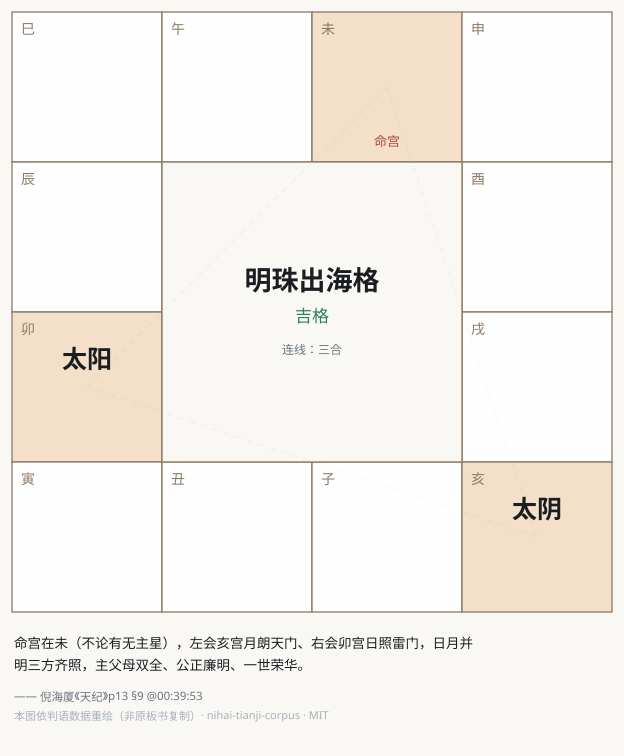
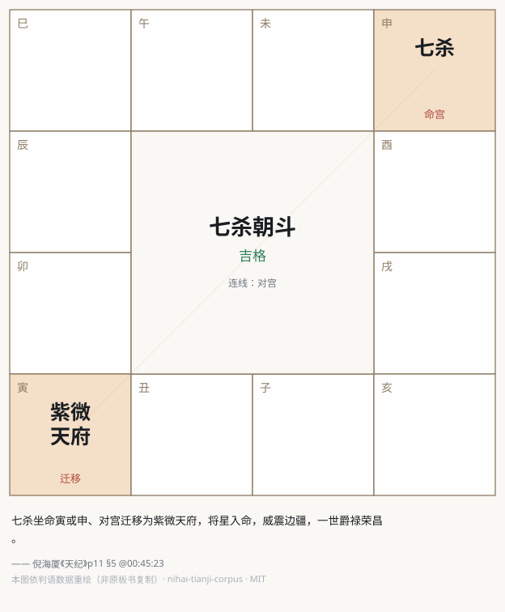

# 倪海厦《天纪》结构化语料库 · nihai-tianji-corpus

     

> 把倪海厦先生《天纪》全部课程做成**每一句都可回放验证**的结构化知识库。
> 每条判语 = 倪师原话短引文 + 十一册体系归属 + 精确到秒的视频出处。
> 点任何一条出处，直达 B 站原视频的那一秒，听倪师亲口讲这句话。

**v2.0 · 天纪全量**：紫微斗数 / 易经（序卦 + 六十四卦）/ 堪舆 / 铁板神数，四学科全覆盖。

## 数字总览

| 指标 | 数值 |
|---|---|
| 判语条目 | **4886 条**（引文净字数 690,289 字，平均 141 字/条） |
| 覆盖课程 | 天纪全部 **112 个单元**、约 61 小时讲课 |
| 知识体系 | **十一册**，倪师授课原生分类 |
| 溯源精度 | 每条带 `[讲 §段 @时:分:秒]`，可拼 B 站 `?p=N&t=秒` 一键回放 |
| 质检 | 七道自动门禁 + 全库 5142 条逐条语义清扫 + 三轮独立抽样审查 |
| 封库终裁 | 162 条随机样本，**问题率 0.0%** |
| 人工勘误 | 171 对字幕错字逐条人工裁决，账本全量公开 |

## 知识体系（倪师授课原生分类）

| 册 | 条数 | 内容 |
|---|---|---|
| [01 主星](docs/01-主星.md) | 378 | 十四主星与辅煞星的定性、性情、格局 |
| [02 十二宫](docs/02-十二宫.md) | 366 | 命宫至父母宫、三方四正、借星 |
| [03 格局](docs/03-格局.md) | 127 | 吉格 / 凶格 / 结构性警示 |
| [04 四化](docs/04-四化.md) | 174 | 化科 / 化权 / 化禄 / 化忌 |
| [05 疾厄](docs/05-疾厄.md) | 80 | 十二地支宫配脏腑、病灾判断 |
| [07 方法论](docs/07-方法论.md) | 751 | 天纪总纲、批命顺序、学习法、面相手相、阳宅化命 |
| [08 易理总纲](docs/08-易理总纲.md) | 400 | 象 / 序卦通义 / 三道 / 卦爻通论 |
| [09 六十四卦](docs/09-六十四卦.md) | **2139** | 六十四卦逐卦：卦象 / 序卦 / 爻辞 / 卜筮 / 人间道 |
| [10 占断](docs/10-占断.md) | 100 | 金钱卦 / 测字 / 六神 / 小六壬 |
| [11 堪舆](docs/11-堪舆.md) | 257 | 峦头理气 / 罗经坐山来龙 / 宅法 |
| [12 铁板神数](docs/12-铁板神数.md) | 114 | 铁板神数 / 皇极经世 / 卦数批命 |

（06 为历史保留编号，无该册。）

另一条浏览轴是**课程轴**：[docs/课程索引.md](docs/课程索引.md)，逐讲语义段大纲 + 段级回放直链。

## 一条判语长什么样

**人读**（`docs/` 册内形态）：

> - 「比如说，你是一子送终，你是半空折翅，通通从福德宫里面批出来的。」 [p03 §10 @00:40:09]

**机读**（`data/entries.jsonl`）：

```json
{"book": "03-patterns", "h2": "…", "h3": "…",
 "quote": "比如说，你是一子送终，你是半空折翅，通通从福德宫里面批出来的。",
 "bvid": "BV1KJsLekEfA", "part": 3, "section": 10, "t_hms": "00:40:09", "note": ""}
```

**回放**：`https://www.bilibili.com/video/BV1KJsLekEfA?p=3&t=2409`

六十四卦册的出处形如 `[卦12 §3 @00:15:20]`，对应视频 `BV1q7BZYcEZP`（分P = 卦号 + 3）。

## 格局重绘图（14 张）

倪师板书上的盘面，**依判语数据用 SVG 重新绘制**——不复制原视频任何像素。
图例：对宫红实线 · 三合金虚线 · 夹绿点线；深底格为成格核心宫。

| | |
|---|---|
|  |  |
| **明珠出海格** · 命宫在未，左会亥宫月朗天门、右会卯宫日照雷门 | **七杀朝斗** · 七杀坐命寅申，对宫迁移为紫微天府 |

每张图标注成格条件与判语出处，可回原视频核对。20 个格局中绘出 14 张，
另 6 个判语只讲现象、未言盘面结构，**据实不画**。全部见 [docs/charts/](docs/charts/)。

## 学习站（124 页，零依赖静态）

```bash
python3 tools/build_site.py && cd site && python3 -m http.server 8000
```

- **双轴导航**：十一册（按体系查）× 112 单元（按课程学，含语义段时间轴）
- **判语卡**：引文 + `▶ 时间码` 一键跳 B 站原秒 + 出处徽章 + 考据标注 + 术语互链
- **全库检索**：4886 条前端索引，输入即筛、关键词高亮；深浅色自适应

页面无框架依赖，可直接部署，也可参照 `tools/build_site.py` 把判语卡组件移植进自有站点。

## 数据是怎么保真的

| 机制 | 说明 |
|---|---|
| 双源交叉 | 人工校正字幕（OCR）× whisper / FunASR 双引擎独立转写，逐讲一致率 60–91%，脚本自算不采信自报 |
| 七道门禁 | 空批次防线 / 秒级去重 / 探针覆盖≥95% / 一致率≥60% / 术语白名单 / 出处可回溯≥95% / 逐字命中≥90% |
| 全库语义清扫 | 5142 条逐条 AI 判读，清洗 1872 条 OCR 噪声、移出 256 条、重挂 95 条 |
| 只删不改 | 清洗文本经**程序逐字符验证为原文子序列**；49 条 AI 越界改字的一律作废转人工 |
| 人工勘误 | 字幕错字须人工逐条裁决，改动留痕 `〔已按裁决改正：X→Y〕`，账本 171 对全量公开 |
| 三轮抽查 | 归类抽查 121 条 → 清扫后复审 150 条 → **封库终裁 162 条，问题率 0.0%** |

完整数据见 **[docs/质量验收档案.md](docs/质量验收档案.md)**。

## 快速开始

**人**：直接读 [docs/](docs/) 十一册；跟课从 [课程索引](docs/课程索引.md) 进。

**AI / RAG**（详见 [AI 使用手册](docs/AI使用手册.md)）：

```python
import json
entries = [json.loads(l) for l in open("data/entries.jsonl", encoding="utf-8")]

# 一条判语 = 一个 chunk，不需再切；book/h2/h3/part 都是现成过滤器
hexagram = [e for e in entries if e["book"] == "09-hexagrams" and "乾为天" in e.get("h2", "")]

def url(e):
    h, m, s = map(int, e["t_hms"].split(":"))
    return f"https://www.bilibili.com/video/{e['bvid']}?p={e['part']}&t={h*3600+m*60+s}"
```

**整包投喂**：[data/corpus-rag.md](data/corpus-rag.md)（约 69 万字 / 100 万+ token）。

## 想要中间层（帧 / 音频 / 转写）？

本库不分发——那属于对原视频的再分发。但**管线全部开源**：照
[tools/REPRODUCE.md](tools/REPRODUCE.md) 可从公开视频完整复现每一个中间层，
文内写清全部踩坑点（音轨选择、whisper 参数陷阱、水印位置过滤、繁简归一等）。

## Roadmap

- [x] 天纪 · 紫微斗数 14 讲 —— v1.0
- [x] 天纪 · 易经序卦 22 讲 + 六十四卦 64 分P
- [x] 天纪 · 堪舆 4 讲 + 铁板神数 8 讲
- [x] 全库语义清扫 + 封库终裁 —— **v2.0，天纪全量**
- [x] 格局重绘图批量化（依判语数据 SVG 重绘，14 张）
- [x] 网站呈现层（双轴导航 + 判语卡 + 一键回放，124 页静态站）

## 关联项目

- [ziwei-doushu](https://github.com/Renhuai123/ziwei-doushu) —— 紫微斗数开源排盘引擎。
  本库是它的知识层：引擎算出盘，本库回答「倪师怎么论这个盘」。

## 版权与致谢

- 《天纪》课程内容著作权归**倪海厦先生及其权利继承人**所有。
- 感谢 B 站 UP 主**程心学**的字幕校正整理工作。本库判语引文的内容是倪师的口述原话，
  整理过程参考了公开视频字幕并做了 171 处人工勘误与双引擎交叉核验；此事已与其沟通并获知悉。
- 本库仅收录短引文 + 出处的结构化条目，用于学习研究；**不含**可还原完整课程的逐字稿；
  所有出处链接指向原视频页面，不搬运任何视听内容。
- 权利方对任何内容提出异议，我们将在收到通知后**立即下架**相应部分。

## 免责声明

内容涉及传统命理学说，属文化研究与学习资料，不构成任何医疗、投资或人生决策建议。
涉医内容切勿据此自行诊治，请咨询执业医师。

## 协议

`data/` 与 `docs/` 语料：[CC BY-NC-SA 4.0](https://creativecommons.org/licenses/by-nc-sa/4.0/deed.zh) ·
`tools/` 代码：MIT · 详见 [LICENSE.md](LICENSE.md)

## 更新日志

- **2026-08-17 · v2.0** 天纪全量：112 单元 / 约 61 小时讲课 / 4886 条判语 / 十一册体系；
  新增易经序卦、六十四卦、堪舆、铁板神数四大块；全库语义清扫与封库终裁（0.0% 问题率）
- **2026-08-16 · v1.0** 首发：紫微斗数 14 讲 1910 条
